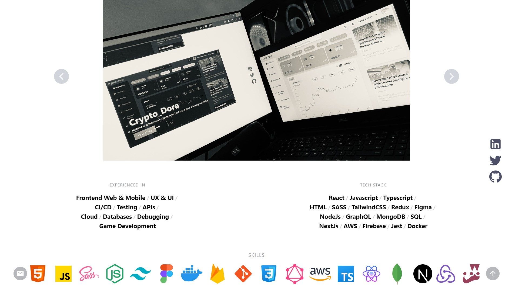

# Portfolio Website
 

#### Live Link: https://www.yasindu.me/

## Welcome to my Portfolio GitHub project! This project is built to showcase my skills and experience for my clients. This is built using the following technologies:

• Next.js: A JavaScript framework for building server-rendered React applications.
 
• Tailwind CSS: A CSS framework for building user interfaces with utility-first styles.
 
• React Router: A JavaScript library intergrated to react for page routing.
 
• Vercel: Used for hosting.
 
• Jest: Used for testing purposes.

# Features

• Skills section showcase my all skills and experiences
 
• Projects section to check all latest projects
 
• Description section for each project
 
• Level Design showcase section
 
• Footer with Google Maps API 
 

# Getting Started

To get started with the Portfolio Project, follow these steps:
 
Clone the repository: git clone https://github.com/YasinduNethmina/portfolio-app.git
Install the dependencies: npm install
Start the development server: npm run dev
The development server will start up and you can view the application at http://localhost:3000.

# Deployment

To deploy the Portfolio App to production, follow these steps:
 
Build the application: npm run build
Deploy the built application to your preferred hosting provider.

# Contributing

We welcome contributions to the project! If you have an idea for a new feature or have found a bug, please open an issue on the GitHub repository. If you would like to contribute code, please fork the repository and submit a pull request.

# License

This project is licensed under the MIT License. See LICENSE for more information.
